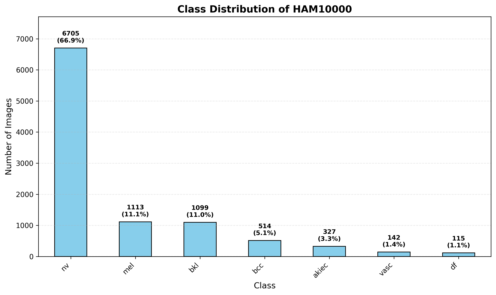
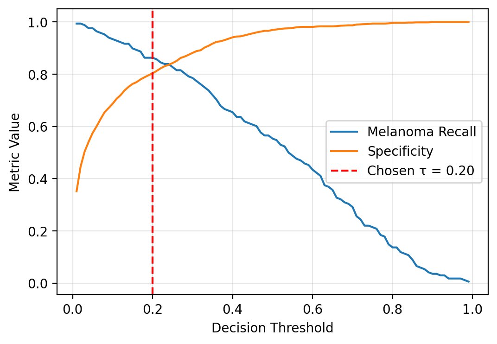
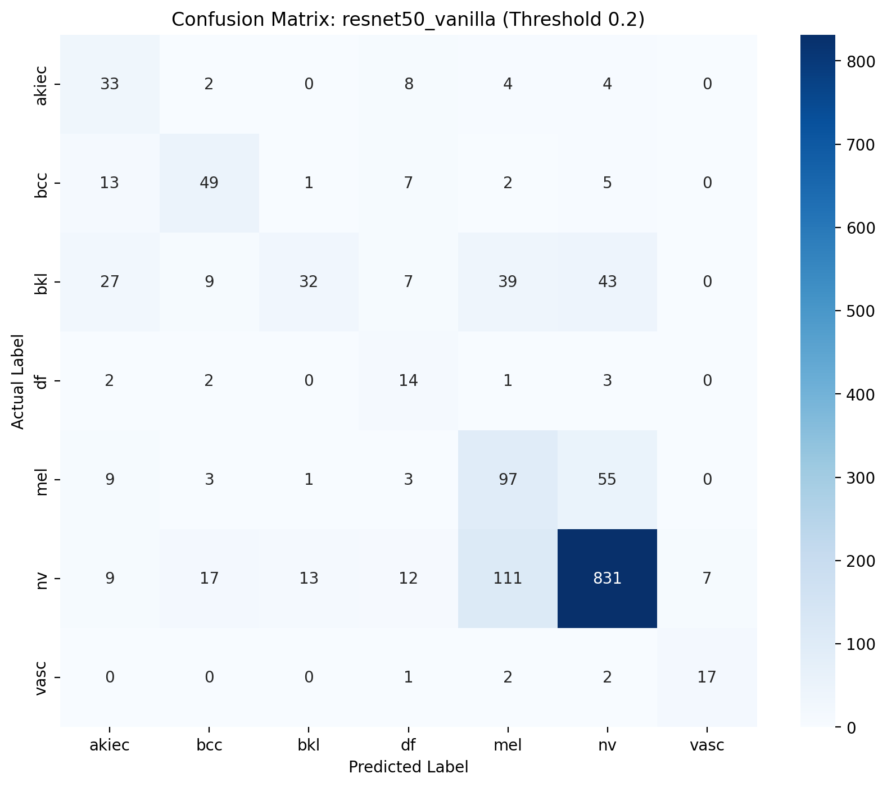
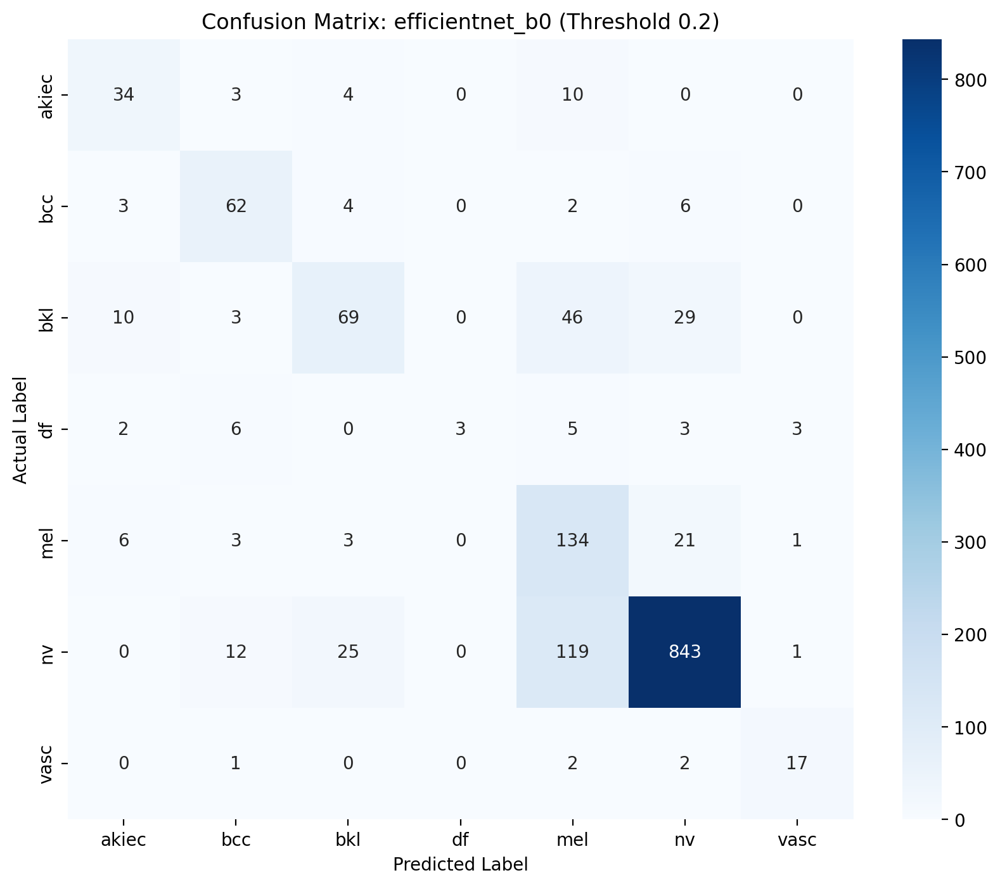
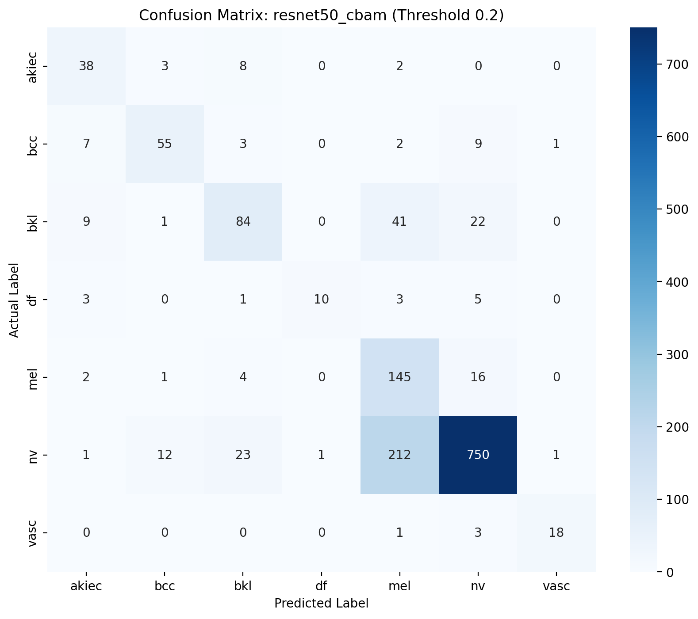
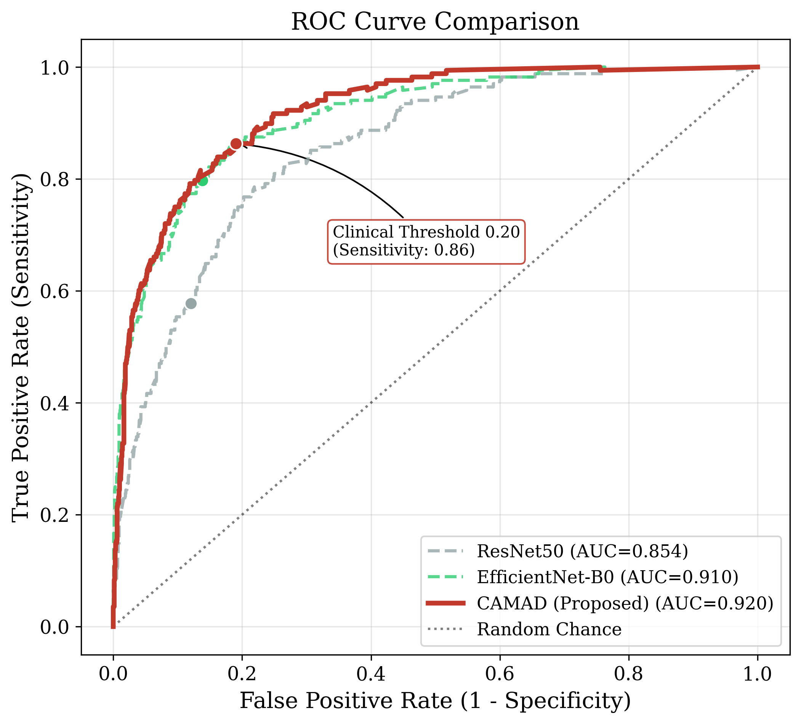
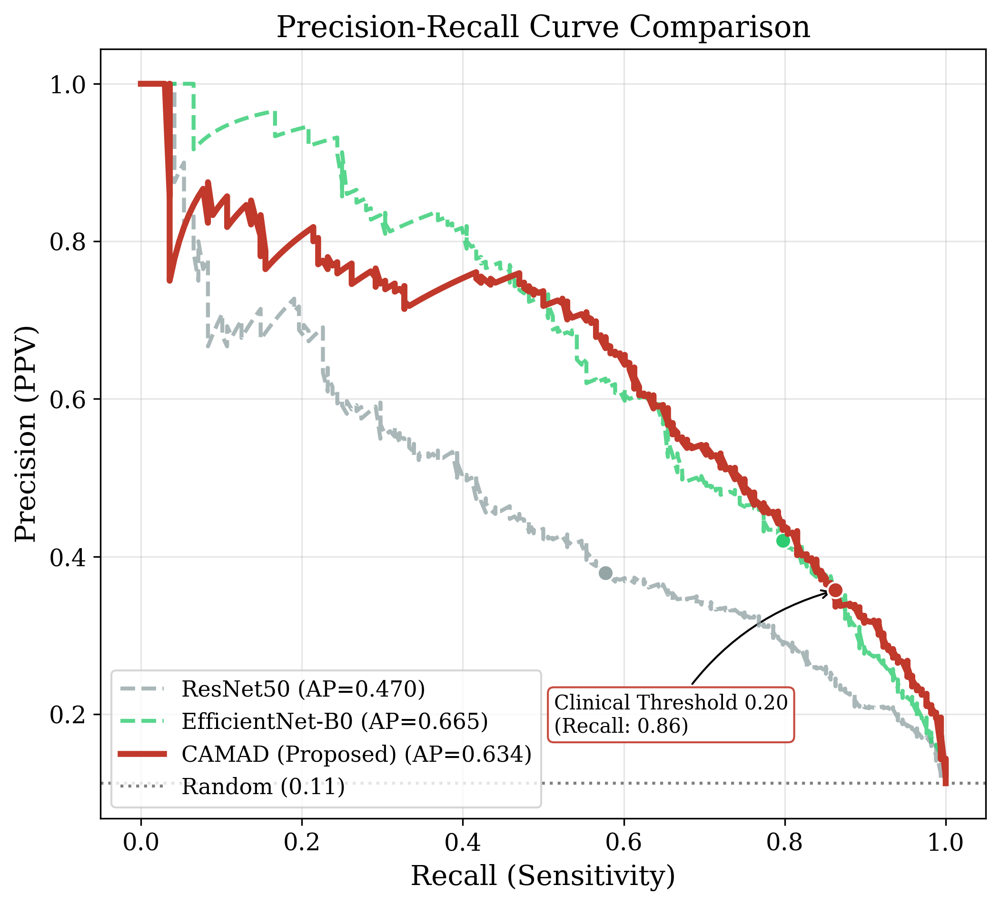
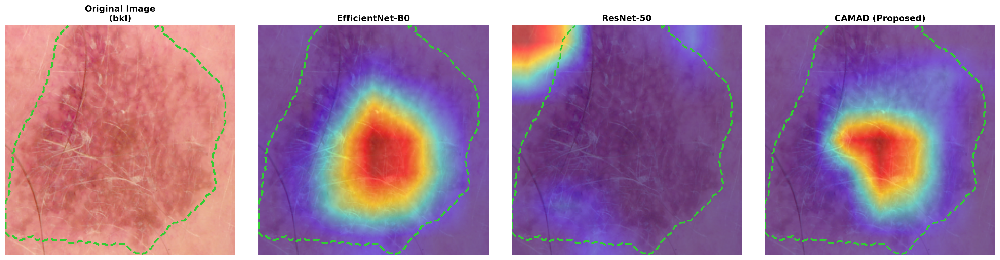
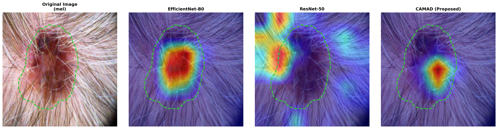

# CAMAD: Class-Aware Multi-Dimensional Framework for Imbalanced Dermoscopic Skin Lesion Classification

[](https://www.python.org/downloads/)
[](https://pytorch.org/)
[](https://opensource.org/licenses/MIT)

## 👥 Authors

| Full Name | Role | Affiliation |
| :--- | :--- | :--- |
| **Mati Nakphon** | Lead Researcher | University of Europe for Applied Sciences |
| **Stallin Ankala** | Researcher | University of Europe for Applied Sciences |
| **Sarawut Boonyarat** | Researcher | University of Europe for Applied Sciences |

### 🏛️ Institutional Affiliation
**University of Europe for Applied Sciences** Faculty of Technology and Design  
Potsdam, Germany

### 📧 Contact Information
For inquiries regarding the **CAMAD** framework, please reach out to the authors:
* **Mati Nakphon**: [mati.nakphon@ue-germany.de](mailto:mati.nakphon@ue-germany.de)
* **Stallin Ankala**: [stallin.ankala@ue-germany.de](mailto:stallin.ankala@ue-germany.de)
* **Sarawut Boonyarat**: [sarawut.boonyarat@ue-germany.de](mailto:sarawut.boonyarat@ue-germany.de)

### 🏛️ Affiliation
**University of Europe for Applied Sciences** Faculty of Technology and Design  
Potsdam, Germany

---

## 📋 Overview

CAMAD is a novel deep learning framework designed to address class imbalance in dermoscopic skin lesion classification. The framework integrates three key strategies to improve melanoma detection while maintaining interpretability:

1. **Class-Specific Augmentation** (Data Level)
2. **Weighted Focal Loss** (Algorithmic Level)
3. **Convolutional Block Attention Modules - CBAM** (Architectural Level)

## 📊 Dataset

This research utilizes the HAM10000 dataset, a standard benchmark for dermoscopic skin lesion analysis.

### Primary Dataset for Model Training & Evaluation
* **Source**: [Skin Cancer MNIST: HAM10000](https://www.kaggle.com/datasets/kmader/skin-cancer-mnist-ham10000) (Kaggle)
* **Contents**: 10,015 dermoscopic images, metadata with lesion_id, diagnosis, age, sex, localization
* **In this project**: Raw data in `data/raw/`, processed in `data/processed/`, splits in `data/splits/`

### Secondary Dataset for Interpretability Validation (Grad-CAM)
* **Source**: [Skin cancer: HAM10000 (with segmentation masks)](https://www.kaggle.com/datasets/surajghuwalewala/ham1000-segmentation-and-classification) (Kaggle)
* **Contents**: Ground truth masks for validating model attention
* **In this project**: Used to validate Grad-CAM focus against actual lesion boundaries

### Class Distribution



| Class | Type | Count | Distribution |
|-------|------|-------|--------------|
| NV (Melanocytic nevi) | Benign | 6,705 | 67.0% |
| MEL (Melanoma) | **Malignant** | 1,113 | 11.1% |
| BKL (Benign keratosis) | Benign | 1,099 | 11.0% |
| BCC (Basal cell carcinoma) | **Malignant** | 514 | 5.1% |
| AKIEC (Actinic keratoses) | **Malignant** | 327 | 3.3% |
| VASC (Vascular lesions) | Benign | 142 | 1.4% |
| DF (Dermatofibroma) | Benign | 115 | 1.1% |
| **Total** | | **10,015** | **100%** |

## 🏗️ Project Structure
```adv_skin_cancer/
├── data/                       # Dataset management
│   ├── raw/                    # Original HAM10000 images (unmodified)
│   ├── processed/              # Images after resizing/normalization
│   └── splits/                 # train_test_split CSV files
├── src/                        # Main source code
│   ├── configs/                # Hyperparameter YAML files
│   ├── models/                 # Model definitions (ResNet50, CBAM)
│   ├── preprocessing/          # Data cleaning and augmentation logic
│   ├── training/               # Training loops and schedulers
│   ├── evaluation/             # Metrics, Confusion Matrices, ROC curves
│   └── visualization/          # Grad-CAM and plotting scripts
├── notebooks/                  # Interactive experimentation
│   ├── 1_eda.ipynb             # Exploratory Data Analysis
│   ├── 2_augmentation.ipynb    # Visualizing class-specific transforms
│   └── 3_inference.ipynb       # Testing the model on single images
├── models/                     # Storage for saved weights
│   ├── checkpoints/            # Periodic saves during training
│   └── final/                  # Best performing .pth or .joblib files
├── reports/                    # Documentation and generated assets
│   └── figures/                # Images used in the README
├── tests/                      # Unit tests for data shapes/loss functions
├── requirements.txt            # Python dependencies
├── .gitignore                  # Files to exclude (e.g., /data, pycache)
└── README.md                   # Project documentation
```
## 🛠️ Methodology

### Class-Specific Augmentation (`src/preprocessing/transforms.py`)


| Class Type | Augmentation Strategy |
|------------|----------------------|
| Majority (NV) | Random Crop, Flip, Rotation ±15° |
| Minority (MEL, BCC, AKIEC) | RandomResizedCrop (0.8–1.0), Rotation ±180°, Color Jitter (±25%) |

### Weighted Focal Loss (`src/training/loss.py`)
- γ = 2.0, w_c = 1.3× for malignant classes

### Attention Mechanism (`src/models/cbam.py`)

CBAM integrated after each residual stage of ResNet-50:
- **Channel Attention**: Focuses on informative feature channels
- **Spatial Attention**: Focuses on lesion area, filters out noise


## 📈 Results

### Clinical Threshold Optimization ($\tau = 0.20$)


### Confusion Matrices at $\tau = 0.20$

| Model | Confusion Matrix |
| :--- | :---: |
| **ResNet-50 (Vanilla)** |  |
| **EfficientNet-B0** |  |
| **CAMAD (Proposed)** |  |

---

### Performance Comparison

| Model | Macro F1 | Melanoma Recall | Benign Precision |
| :--- | :---: | :---: | :---: |
| ResNet-50 | 0.5455 | 57.74% | 63.49% |
| EfficientNet-B0 | 0.6229 | 79.76% | 84.06% |
| **CAMAD (Proposed)** | **0.6889** | **86.31%** | **85.59%** |

### Clinical Safety Improvement

| Model | Missed Melanoma (FN) | Error Rate | Safety Improvement |
| :--- | :---: | :---: | :---: |
| ResNet-50 | 55 | 32.74% | - |
| EfficientNet-B0 | 21 | 12.50% | 61.8% |
| **CAMAD** | **16** | **9.52%** | **70.9%** |

---

### ROC and PR Curves

| ROC Curve | PR Curve |
| :---: | :---: |
|  |  |

> **Summary Metrics:** > * **AUC-ROC:** CAMAD: **0.920** | EfficientNet-B0: 0.910 | ResNet-50: 0.854

---

## 🔍 Model Interpretability with Grad-CAM

| Localization Recovery | High Precision | Artifact Robustness |
| :---: | :---: | :---: |
|  |  |  |

---
## 📚 References

1. **[1]** S. Son, S. Park, and J. Kim, “Entropy-aware similarity for balanced clustering: A case study with melanoma detection,” *arXiv preprint*, vol. arXiv:2305.15417, May 2023. [Online]. Available: [https://arxiv.org/abs/2305.15417](https://arxiv.org/abs/2305.15417)
2. **[2]** A. Esteva, B. Kuprel, R. A. Novoa, J. Ko, S. M. Swetter, H. M. Blau, and S. Thrun, “Dermatologist-level classification of skin cancer with deep neural networks,” *Nature*, vol. 542, no. 7639, pp. 115–118, Feb. 2017.
3. **[3]** P. Tschandl, C. Rosendahl, and H. Kittler, “The HAM10000 dataset, a large collection of multi-source dermatoscopic images of common pigmented skin lesions,” *Scientific Data*, vol. 5, p. 180161, 2018.
4. **[4]** M. L. Allaoui and M. Saïd Allili, “Mixlvmm: A mixture of lightweight vision mamba model for enhancing skin lesion segmentation across high tone variability,” *IEEE Access*, vol. 13, pp. 121,234–121,249, 2025.
5. **[5]** C. J. Hellín, A. A. Olmedo, A. Valledor, J. Gómez, M. López-Benítez, and A. Tayebi, “Unraveling the impact of class imbalance on deep-learning models for medical image classification,” *Applied Sciences*, vol. 14, no. 8, p. 3419, 2024.
6. **[6]** J. M. Johnson and T. M. Khoshgoftaar, “Survey on deep learning with class imbalance,” *Journal of Big Data*, vol. 6, p. 27, 2019.
7. **[7]** M. H. Bernstein, M. K. Atalay, E. H. Dibble, A. W. P. Maxwell, A. R. Karam, S. Agarwal, R. C. Ward, T. T. Healey, and G. L. Baird, “Can incorrect artificial intelligence (AI) results impact radiologists, and if so, what can we do about it? a multi-reader pilot study of lung cancer detection with chest radiography,” *European Radiology*, vol. 33, no. 11, pp. 8263–8269, 2023.
8. **[8]** J. L. Cross, M. A. Choma, and J. A. Onofrey, “Bias in medical AI: Implications for clinical decision-making,” *PLOS Digital Health*, vol. 3, no. 11, p. e0000651, 2024.
9. **[9]** M.-C. Monard and G. Batista, “Learning with skewed class distributions,” *Adv. Log. Artif. Intell. Robot. LAPTEC*, vol. 2002, Jan 2002.
10. **[10]** M. Alsaidi, M. Jan, A. Altaher, H. Zhuang, and X. Zhu, “Tackling the class imbalanced dermoscopic image classification using data augmentation and GAN,” *Multimedia Tools and Applications*, vol. 83, Oct 2023.
11. **[11]** Z. Hu, W. Mei, H. Chen, and W. Hou, “Multi-scale feature fusion and class weight loss for skin lesion classification,” *Computers in Biology and Medicine*, vol. 176, p. 108594, 2024.
12. **[12]** A. Alotaibi and D. AlSaeed, “Skin cancer detection using transfer learning and deep attention mechanisms,” *Diagnostics*, vol. 15, no. 1, p. 99, 2025.
13. **[13]** N. Gilal, S. Ahmed, J. Schneider, M. Househ, and M. Agus, “Mobile dermatoscopy: Class imbalance management based on blurring augmentation, iterative refining and cost-weighted recall loss,” *J. Image Graph.*, vol. 11, no. 2, pp. 161–169, 2023.
14. **[14]** M. A. Kassem, K. M. Hosny, R. Damaševičius, and M. M. Eltoukhy, “Machine learning and deep learning methods for skin lesion classification and diagnosis: A systematic review,” *Diagnostics*, vol. 11, no. 8, p. 1390, 2021.
15. **[15]** S. Woo, J. Park, J. Lee, and I. S. Kweon, “CBAM: convolutional block attention module,” *CoRR*, vol. abs/1807.06521, 2018. [Online]. Available: [http://arxiv.org/abs/1807.06521](http://arxiv.org/abs/1807.06521)
16. **[16]** T. Lin, P. Goyal, R. B. Girshick, K. He, and P. Dollár, “Focal loss for dense object detection,” *CoRR*, vol. abs/1708.02002, 2017. [Online]. Available: [http://arxiv.org/abs/1708.02002](http://arxiv.org/abs/1708.02002)
17. **[17]** Q. McNemar, “Note on the sampling error of the difference between correlated proportions or percentages,” *Psychometrika*, vol. 12, no. 2, pp. 153–157, 1947. [Online]. Available: [https://doi.org/10.1007/BF02295996](https://doi.org/10.1007/BF02295996)
18. **[18]** J. Cohen, “A coefficient of agreement for nominal scales,” *Educational and Psychological Measurement*, vol. 20, no. 1, pp. 37–46, 1960. [Online]. Available: [https://doi.org/10.1177/001316446002000104](https://doi.org/10.1177/001316446002000104)
19. **[19]** G. Argenziano, “Human–computer collaboration for skin cancer recognition,” *Nature Medicine*, vol. 26, pp. 814–815, 2020. [Online]. Available: [https://doi.org/10.1038/s41591-020-0942-0](https://doi.org/10.1038/s41591-020-0942-0)

