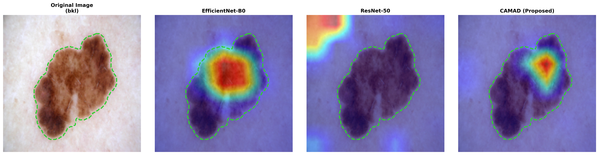

# CAMAD: Class-Aware Multi-Dimensional Framework for Imbalanced Dermoscopic Skin Lesion Classification

[](https://www.python.org/downloads/)
[](https://pytorch.org/)
[](https://opensource.org/licenses/MIT)

> **Note:** the version badges must match `requirements.txt`. The compiled
> bytecode in `src/__pycache__/` is `cpython-313`, so the reported runs used
> Python 3.13, not 3.9. Please confirm and align this with the manuscript.
> An MIT badge is shown but **no `LICENSE` file exists in the repository** —
> add one or remove the badge.

## 👥 Authors

| Full Name | Role | Affiliation |
| :--- | :--- | :--- |
| **Mati Nakphon** | Lead Researcher | University of Europe for Applied Sciences |
| **Stallin Ankala** | Researcher | University of Europe for Applied Sciences |
| **Sarawut Boonyarat** | Researcher | University of Europe for Applied Sciences |

**University of Europe for Applied Sciences**, Faculty of Technology and Design, Potsdam, Germany

Contact: [mati.nakphon@ue-germany.de](mailto:mati.nakphon@ue-germany.de) ·
[stallin.ankala@ue-germany.de](mailto:stallin.ankala@ue-germany.de) ·
[sarawut.boonyarat@ue-germany.de](mailto:sarawut.boonyarat@ue-germany.de)

---

## 📋 Overview

CAMAD addresses class imbalance in dermoscopic skin lesion classification at
three levels simultaneously, within a single ResNet-50 architecture:

1. **Class-specific augmentation + inverse-frequency balanced sampling** (data level)
2. **Focal training objective**, γ = 2.0 (algorithmic level)
3. **Convolutional Block Attention Modules (CBAM)** after each residual stage (architectural level)

A melanoma decision threshold is then selected on the validation partition
under an explicit clinical criterion, and results are reported at that
operating point rather than at the default `argmax` rule.

> **On the objective.** The framework defines a weighted focal loss with an
> explicit class-weight vector `w_c = N / (C · n_c)` and a 1.3× boost on the
> malignant classes (`src/utils.py::get_class_weights`). In the **reported
> model**, `src/train.py` instantiates `FocalLoss(gamma=2.0, alpha=None)` and
> class balancing is provided by the `WeightedRandomSampler` instead. The
> explicit weight vector is applied in the **ablation configurations**
> (`src/run_ablation.py`). This is stated in the manuscript's Limitations
> section and is reproduced here so the code and the paper agree.

## 📊 Dataset

### Primary — training and evaluation
* **Source**: [Skin Cancer MNIST: HAM10000](https://www.kaggle.com/datasets/kmader/skin-cancer-mnist-ham10000) (Kaggle)
* **Contents**: 10,015 dermoscopic images; metadata with `lesion_id`, `dx`, age, sex, localization
* **In this project**: raw images in `data/raw/`, split CSVs (`train.csv`, `val.csv`, `test.csv`) in `data/processed/`

### Secondary — Grad-CAM interpretability validation
* **Source**: [HAM10000 with segmentation masks](https://www.kaggle.com/datasets/surajghuwalewala/ham1000-segmentation-and-classification) (Kaggle)
* **Contents**: ground-truth lesion masks, used to check Grad-CAM focus against actual lesion boundaries

### Class distribution


| Class | Type | Count | Share |
|-------|------|-------|-------|
| NV (Melanocytic nevi) | Benign | 6,705 | 67.0% |
| MEL (Melanoma) | **Malignant** | 1,113 | 11.1% |
| BKL (Benign keratosis) | Benign | 1,099 | 11.0% |
| BCC (Basal cell carcinoma) | **Malignant** | 514 | 5.1% |
| AKIEC (Actinic keratoses) | **Malignant** | 327 | 3.3% |
| VASC (Vascular lesions) | Benign | 142 | 1.4% |
| DF (Dermatofibroma) | Benign | 115 | 1.1% |
| **Total** | | **10,015** | **100%** |

### Splitting

Images are grouped by `lesion_id` before splitting, so every image of a given
lesion stays in one partition and no lesion leaks between train, validation
and test. The split is stratified on the lesion-level label at 70 / 15 / 15
with `random_state = 42` (`src/utils.py::make_stratified_split`), giving
**1,464 validation** and **1,497 test** images, each containing 168 melanomas.

---

## ⚙️ Installation

```bash
git clone https://github.com/oagaudit/CAMAD.git
cd CAMAD
python -m venv .venv && source .venv/bin/activate
pip install -r requirements.txt
```

Download both Kaggle datasets and place the raw HAM10000 images under
`data/raw/HAM10000_images_part_1/` and `data/raw/HAM10000_images_part_2/`,
with `HAM10000_metadata.csv` in `data/raw/`. Paths are defined in
`src/config.py`.

## ▶️ Reproducing the results

Run the notebooks in order. The model to train or evaluate is selected with a
single switch, `Config.SELECTED_EXP`, which accepts `resnet50_cbam` (CAMAD),
`resnet50_vanilla`, or `efficientnet_b0`.

| Step | File | Produces |
| :--- | :--- | :--- |
| 1. Explore data | `notebooks/0_data_exploration.ipynb` | class distribution figure |
| 2. Build splits | `notebooks/1_data_prep.ipynb` | `data/processed/{train,val,test}.csv` |
| 3. Sanity checks | `notebooks/2_data_loading_test.ipynb`, `3_model_test.ipynb` | — |
| 4. Train | `notebooks/4_training_main.ipynb` | `models/checkpoints/best_model_<exp>.pth` |
| 5. Random Forest baseline | `notebooks/7_baseline_rf.ipynb` | `models/rf_baseline_model.joblib` |
| 6. Select threshold | `notebooks/9_Threshold analysis.ipynb` | τ from the **validation** partition |
| 7. Evaluate at τ | `notebooks/5_evaluation_with_treshold.ipynb` | comparison tables, confusion matrices, McNemar |
| 8. Grad-CAM | `notebooks/6_gradcam.ipynb` | attention overlays |
| 9. Ablation | `python -m src.run_ablation` | `results/ablation_*/ablation_final.csv` |

Seeds for Python, NumPy and PyTorch are fixed at 42 and cuDNN is set to
deterministic mode (`src/utils.py::seed_everything`). All reported numbers
come from a **single run on a single split**; variance across seeds is not
characterised.

## 🏗️ Project structure

```
CAMAD/
├── data/                            # not tracked in git
│   ├── raw/                         # original HAM10000 images + metadata CSV
│   └── processed/                   # train.csv / val.csv / test.csv
├── src/
│   ├── config.py                    # all paths and hyperparameters (Config class)
│   ├── utils.py                     # seeding, lesion-level split, class weights
│   ├── dataset.py                   # HAM10000Dataset, WeightedRandomSampler loader
│   ├── transforms.py                # light / heavy class-specific augmentation
│   ├── models.py                    # CBAM blocks, ResNet-50+CBAM, EfficientNet-B0
│   ├── loss.py                      # FocalLoss
│   ├── train.py                     # training loop, scheduler, checkpointing
│   ├── eval.py                      # metrics, confusion matrices, McNemar, kappa
│   ├── gradcam.py                   # attention visualisation
│   └── run_ablation.py              # ablation driver
├── notebooks/                       # 0_ … 9_, see table above
├── models/checkpoints/              # saved weights (not tracked)
├── reports/
│   ├── figures/                     # figures used in the paper and this README
│   └── metrics/                     # classification reports, comparison CSVs
├── requirements.txt
└── README.md
```

---

## 🛠️ Methodology

### Class-specific augmentation — `src/transforms.py`


Augmentation strength is conditioned on class. The **light** pipeline is
applied to the majority class only; the **heavy** pipeline is applied to all
six remaining classes, not only the malignant ones
(`Config.MINORITY_CLASSES = ['mel','bcc','bkl','akiec','vasc','df']`).

| Pipeline | Classes | Transforms |
| :--- | :--- | :--- |
| Light | NV | `Resize(256)` → `RandomCrop(224)`, `RandomHorizontalFlip(p=0.5)`, `RandomRotation(15)` |
| Heavy | MEL, BCC, BKL, AKIEC, VASC, DF | `RandomResizedCrop(224, scale=(0.8, 1.0))`, `RandomHorizontalFlip(p=0.5)`, `RandomVerticalFlip(p=0.5)`, `RandomRotation(90)`, `ColorJitter(brightness=0.1, contrast=0.1, saturation=0.1, hue=0.01)` |

Both are followed by ImageNet normalisation. Validation and test use
`Resize(224)` and normalisation only.

**Balanced sampling** — `WeightedRandomSampler` with per-sample weight
`1 / n_c`, drawn with replacement, `num_samples = len(dataset)`
(`src/dataset.py::get_weighted_dataloader`).

### Loss — `src/loss.py`

Focal loss following Lin et al., `FL(p_t) = -α_t (1 - p_t)^γ log(p_t)`, with
**γ = 2.0**. The `alpha` argument accepts a per-class weight vector; see the
note in the Overview for which configurations use it.

### Attention — `src/models.py`

CBAM is inserted after each of the four residual stages of ResNet-50
(256 / 512 / 1024 / 2048 channels).

* **Channel attention**: parallel avg + max pooling → shared bottleneck, reduction ratio 16
* **Spatial attention**: 7×7 convolution over channel-wise avg and max maps
* **Head**: `Dropout(p=0.5)` → `Linear(2048, 7)`

### Training configuration — `src/config.py`

| Parameter | Value |
| :--- | :--- |
| Backbone | ResNet-50, ImageNet-1K pre-trained |
| Optimiser | Adam, weight decay 3e-5 |
| Learning rate | 1e-4 |
| Batch size | 32 |
| Max epochs | 50 |
| LR schedule | `ReduceLROnPlateau(mode='min', patience=3, factor=0.1)` |
| Stopping rule | training halts when the learning rate falls below 1e-6 |
| Model selection | checkpoint with the lowest **validation** loss |
| Hardware | Apple M3, 16 GB unified memory, PyTorch MPS backend |
| Seed | 42 |

### Baselines

* **EfficientNet-B0** and **vanilla ResNet-50**: standard augmentation, cross-entropy, no balanced sampler
* **Random Forest** (`notebooks/7_baseline_rf.ipynb`): images resized to 64×64 and flattened to a 12,288-dimensional raw RGB vector scaled to [0,1]; `RandomForestClassifier(n_estimators=100, class_weight='balanced', random_state=42)`

---

## 🎯 Clinical threshold selection

At inference the default `argmax` rule is replaced by a melanoma-override
rule (`notebooks/5_evaluation_with_treshold.ipynb::apply_threshold`):

```
ŷ(x) = MEL              if P_MEL(x) ≥ τ
       argmax_c P_c(x)  otherwise
```

τ is chosen by grid search over `[0.01, 0.99]` in steps of 0.01 **on the
validation partition**, maximising melanoma sensitivity subject to
specificity ≥ 0.80 on the melanoma-versus-rest problem. The constrained
optimum is **τ = 0.17**, which sits directly on the constraint boundary; it
is rounded up to the nearest 0.05, giving the adopted operating point
**τ = 0.20**.


### Why the rounding matters

| Partition | τ | Melanoma sensitivity | Specificity |
| :--- | :---: | :---: | :---: |
| Validation (n=1,464) | 0.17 | 88.10% | 80.02% |
| Validation (n=1,464) | **0.20** | 85.71% | 82.18% |
| Test (n=1,497) | 0.17 | 88.69% | **78.03% ✗** |
| Test (n=1,497) | **0.20** | 86.31% | **80.36% ✓** |

The unrounded validation optimum violates the specificity constraint on the
held-out partition; the 2.2-point margin introduced by rounding is what
allows the constraint to survive out of sample. This is a lower bound on the
recalibration a real deployment would require.

---

## 📈 Results

All numbers below are on the 1,497-image held-out test partition.

### Performance comparison

| Model | τ | Macro F1 | Melanoma recall | Malignant avg recall | Benign avg precision |
| :--- | :---: | :---: | :---: | :---: | :---: |
| Random Forest | — | 0.2754 | 1.79% | 16.87% | 54.20% |
| ResNet-50 | 0.50 | 0.5505 | 25.60% | 53.27% | 62.63% |
| EfficientNet-B0 | 0.50 | 0.6500 | 61.31% | 73.42% | 82.72% |
| **CAMAD** | 0.50 | **0.7164** | 57.14% | 68.78% | 82.47% |
| ResNet-50 | 0.20 | 0.5455 | 57.74% | 62.03% | 63.49% |
| EfficientNet-B0 | 0.20 | 0.6229 | 79.76% | 75.65% | 84.06% |
| **CAMAD** | 0.20 | **0.6889** | **86.31%** | **77.42%** | **85.59%** |

*Malignant avg recall* = mean recall over {AKIEC, BCC, MEL}.
*Benign avg precision* = mean precision over {BKL, DF, NV, VASC}.

### Clinical safety — melanoma misclassified as nevus (τ = 0.20)

| Model | MEL → NV | Rate (95% CI, Wilson) | Reduction vs baseline |
| :--- | :---: | :---: | :---: |
| Random Forest | 153 | 91.07% (85.8–94.5) | — |
| ResNet-50 | 55 | 32.74% (26.1–40.2) | — |
| EfficientNet-B0 | 21 | 12.50% (8.3–18.4) | 61.8% |
| **CAMAD** | **16** | **9.52% (5.9–14.9)** | **70.9%** |

This counts melanomas assigned specifically to the **nevus** class, which is
a subset of all melanoma errors. It is therefore smaller than the count
implied by melanoma recall in the table above — the two quantities measure
different things.

### The precision cost

At τ = 0.20 CAMAD flags 406 lesions as melanoma, of which 145 are melanoma.

| Model | Melanoma precision @ τ=0.20 | Specificity |
| :--- | :---: | :---: |
| CAMAD | 35.71% | 80.36% |
| EfficientNet-B0 | 42.14% | 86.16% |
| ResNet-50 | 37.89% | 88.04% |

CAMAD spends the entire available specificity budget to buy recall, which is
the intended behaviour for a triage tool but is a real review-workload cost.

### Confusion matrices at τ = 0.20

| ResNet-50 | EfficientNet-B0 | CAMAD |
| :---: | :---: | :---: |
|  |  |  |

### Statistical significance

McNemar's exact test on paired predictions over all 1,497 test images, with
correctness defined on the full seven-class label at τ = 0.20. Cohen's κ
measures agreement **between the two models' predictions**, not agreement
with the ground truth.

| Comparison | p-value | Cohen's κ | Significant at α = 0.05 |
| :--- | :---: | :---: | :---: |
| CAMAD vs. EfficientNet-B0 | 0.00049 | 0.6205 | yes |
| CAMAD vs. ResNet-50 | 0.16871 | 0.5244 | **no** |
| CAMAD vs. Random Forest | 0.02767 | 0.1427 | yes |

**The difference from ResNet-50 is not statistically significant.** The
reduction from 55 to 16 melanoma-to-nevus errors is reported as a
descriptive observation on a single test partition, not as a confirmed
statistical effect.

### ROC and precision–recall

| ROC | PR |
| :---: | :---: |
|  |  |

**AUC-ROC** — CAMAD **0.920** · EfficientNet-B0 0.910 · ResNet-50 0.854
**Average precision** — CAMAD **0.634** · EfficientNet-B0 0.605 · ResNet-50 0.470

### Grad-CAM

Attention maps compared against ground-truth lesion contours from the
segmentation-annotated HAM10000 redistribution. The comparison is
qualitative; no overlap statistic between attention maps and masks is
computed.

| Localisation recovery | High precision | Artifact robustness |
| :---: | :---: | :---: |
|  |  |  |

---

## ⚠️ Limitations

* **Single run, single split.** One seed, one lesion-level partition. Variance across seeds and splits is not reported, so small gaps between neighbouring configurations may lie within run-to-run noise.
* **The ablation is not a controlled decomposition.** The four ablation configurations differ in the training schedule (15 vs 50 epochs), in whether the balanced sampler is used, and in whether the explicit class weights are applied — not only in the component named in each row. Only the baseline and the full model share a schedule.
* **Threshold transfer.** The constrained optimum already fails to transfer between two partitions of the same dataset. Deployment under genuine distribution shift will require recalibration on local validation data.
* **Single-centre retrospective data.** HAM10000 does not represent the full diversity of skin tones, devices, and clinical presentations. No external validation has been performed.
* **Interpretability evidence is qualitative.** Illustrative cases were selected manually.

## 📄 Citation

```bibtex
@misc{nakphon2026camad,
  title  = {Class-Aware Multi-Dimensional Framework for Imbalanced
            Dermoscopic Skin Lesion Classification},
  author = {Nakphon, Mati and Ankala, Stallin and Boonyarat, Sarawut},
  year   = {2026},
  note   = {Preprint},
  url    = {https://github.com/oagaudit/CAMAD}
}
```

## 📚 References

1. S. Son, S. Park, and J. Kim, "Entropy-aware similarity for balanced clustering: A case study with melanoma detection," *arXiv:2305.15417*, 2023.
2. A. Esteva *et al.*, "Dermatologist-level classification of skin cancer with deep neural networks," *Nature*, vol. 542, no. 7639, pp. 115–118, 2017.
3. P. Tschandl, C. Rosendahl, and H. Kittler, "The HAM10000 dataset," *Scientific Data*, vol. 5, p. 180161, 2018.
4. M. L. Allaoui and M. Saïd Allili, "MixLVMM: A mixture of lightweight vision Mamba model for enhancing skin lesion segmentation across high tone variability," *IEEE Access*, vol. 13, pp. 121,234–121,249, 2025.
5. C. J. Hellín *et al.*, "Unraveling the impact of class imbalance on deep-learning models for medical image classification," *Applied Sciences*, vol. 14, no. 8, p. 3419, 2024.
6. J. M. Johnson and T. M. Khoshgoftaar, "Survey on deep learning with class imbalance," *Journal of Big Data*, vol. 6, p. 27, 2019.
7. M. H. Bernstein *et al.*, "Can incorrect artificial intelligence (AI) results impact radiologists…," *European Radiology*, vol. 33, no. 11, pp. 8263–8269, 2023.
8. J. L. Cross, M. A. Choma, and J. A. Onofrey, "Bias in medical AI: Implications for clinical decision-making," *PLOS Digital Health*, vol. 3, no. 11, p. e0000651, 2024.
9. M.-C. Monard and G. Batista, "Learning with skewed class distributions," *Adv. Log. Artif. Intell. Robot. LAPTEC*, 2002.
10. M. Alsaidi *et al.*, "Tackling the class imbalanced dermoscopic image classification using data augmentation and GAN," *Multimedia Tools and Applications*, vol. 83, 2023.
11. Z. Hu, W. Mei, H. Chen, and W. Hou, "Multi-scale feature fusion and class weight loss for skin lesion classification," *Computers in Biology and Medicine*, vol. 176, p. 108594, 2024.
12. A. Alotaibi and D. AlSaeed, "Skin cancer detection using transfer learning and deep attention mechanisms," *Diagnostics*, vol. 15, no. 1, p. 99, 2025.
13. N. Gilal *et al.*, "Mobile dermatoscopy: Class imbalance management based on blurring augmentation, iterative refining and cost-weighted recall loss," *J. Image Graph.*, vol. 11, no. 2, pp. 161–169, 2023.
14. M. A. Kassem *et al.*, "Machine learning and deep learning methods for skin lesion classification and diagnosis: A systematic review," *Diagnostics*, vol. 11, no. 8, p. 1390, 2021.
15. S. Woo, J. Park, J.-Y. Lee, and I. S. Kweon, "CBAM: Convolutional block attention module," in *Proc. ECCV*, 2018, pp. 3–19.
16. T.-Y. Lin, P. Goyal, R. Girshick, K. He, and P. Dollár, "Focal loss for dense object detection," in *Proc. ICCV*, 2017, pp. 2980–2988.
17. Q. McNemar, "Note on the sampling error of the difference between correlated proportions or percentages," *Psychometrika*, vol. 12, no. 2, pp. 153–157, 1947.
18. J. Cohen, "A coefficient of agreement for nominal scales," *Educational and Psychological Measurement*, vol. 20, no. 1, pp. 37–46, 1960.
19. K. He, X. Zhang, S. Ren, and J. Sun, "Deep residual learning for image recognition," in *Proc. CVPR*, 2016, pp. 770–778.
20. M. Tan and Q. V. Le, "EfficientNet: Rethinking model scaling for convolutional neural networks," in *Proc. ICML*, 2019, pp. 6105–6114.
21. R. R. Selvaraju *et al.*, "Grad-CAM: Visual explanations from deep networks via gradient-based localization," in *Proc. ICCV*, 2017, pp. 618–626.
22. E. B. Wilson, "Probable inference, the law of succession, and statistical inference," *JASA*, vol. 22, no. 158, pp. 209–212, 1927.
23. S. Ghuwalewala, "HAM10000 with segmentation masks," Kaggle dataset. [Online]. Available: https://www.kaggle.com/datasets/surajghuwalewala/ham1000-segmentation-and-classification
